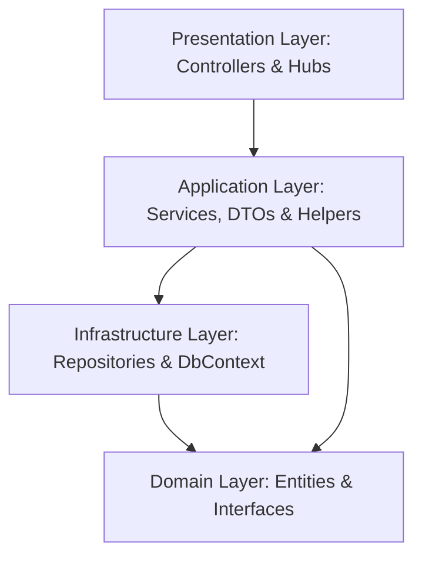

# MyDatingApp

A full-stack, real-time dating application featuring rich profile discovery, private messaging, image management, matching systems, and online presence tracking. The application is built using a highly structured **ASP.NET Core Web API** backend and a modern **Angular 21** frontend.

---

## Table of Contents
1. [Project Overview](#project-overview)
2. [Key Features](#key-features)
3. [Technology Stack](#technology-stack)
4. [Architecture Overview](#architecture-overview)
5. [Backend Features](#backend-features)
6. [Frontend Features](#frontend-features)
7. [Real-Time Features (SignalR)](#real-time-features-signalr)
8. [Database Schema & Data Access](#database-schema--data-access)
9. [API Documentation Summary](#api-documentation-summary)
10. [Environment Variables](#environment-variables)
11. [Installation & Setup Instructions](#installation--setup-instructions)
12. [Future Improvements](#future-improvements)
13. [Screenshots](#screenshots)

---

## Project Overview

**MyDatingApp** is a modern web application designed to connect people in real time. It enables users to create highly customized dating profiles, upload multiple photos, filter potential matches based on preferences (such as gender and age), like other profiles, track mutual matches, and chat in real time.

The system is designed with scalability, security, and low-latency communication in mind. The backend leverages ASP.NET Core with Entity Framework Core and SQLite, coupled with JWT authorization and cookie-based refresh tokens. Low-latency real-time communication is facilitated by SignalR hubs. The frontend utilizes Angular 21 (standalone style) with reactive signals and state integration.

---

## Key Features

- **Secure Authentication & Session Management**: Supports register, login, logout, and automatic session extension using JWT access tokens (7-minute expiry) and cryptographically secure refresh tokens (7-day expiry) delivered via HttpOnly cookies.
- **Detailed Member Profiles**: Users can search, view, and update their profiles (including description, city, country, and interests) and track their last active timestamp.
- **Rich Photo Management**: Integration with Cloudinary for secure file storage, including automated face-detection cropping, main profile photo assignment, and media deletion.
- **Matchmaking (Likes System)**: Features bidirectional liking of profiles. Users can like or unlike profiles and filter lists by "Liked Members", "Liked By", or "Mutual Matches".
- **Real-Time Group Chat**: Low-latency direct messaging where users join a unique SignalR room mapped to a SQLite group schema. It tracks message delivery, marks messages as read, and archives message history.
- **Live Presence Tracking**: Visually monitors online status across the platform using an in-memory concurrent tracker, notifying users when their matches come online or go offline.
- **Admin Control Panel**: Fine-grained role-based access control (RBAC) allowing admins and moderators to manage roles and query registered members.

---

## Technology Stack

| Layer | Technology | Purpose |
|---|---|---|
| **Backend Core** | ASP.NET Core Web API (.NET 10.0) | High-performance enterprise REST API |
| **Real-time Hubs** | ASP.NET Core SignalR | WebSockets abstraction for real-time chat & presence |
| **Database** | SQLite (File-based) | Relational database (using EF Core migrations) |
| **Data Access** | Entity Framework Core (EF Core 10.0) | ORM implementing Unit of Work & Repository patterns |
| **Authentication** | ASP.NET Core Identity & JWT Bearer | RBAC and token validation mechanisms |
| **Object Mapping** | AutoMapper (v16.1.1) | Clean decoupling of database entities from DTOs |
| **Image Hosting** | Cloudinary DotNet SDK (v1.29.2) | Cloud image transformation, face detection, and delivery |
| **Frontend Core** | Angular 21, RxJS, TypeScript | Modern, high-speed single-page application framework |
| **Testing** | Vitest (Frontend) | Unit and integration testing |

---

## Architecture Overview

The backend uses a **Layered Clean Architecture** pattern designed inside a single project folder, separated into logical boundaries:



- **Domain Layer (`Domain/`)**: Contains the database entities (`AppUser`, `Member`, `Photo`, `MemberLike`, `Message`) and repositories/Unit of Work interfaces. It holds no external dependencies.
- **Application Layer (`Application/`)**: Implements service interfaces, DTOs (`LoginDto`, `RegisterDto`, `MemberDto`, etc.), mapping configurations, and core business models.
- **Infrastructure Layer (`Infrastructer/`)**: Implements database interactions via EF Core context (`AppDbContext`), repositories (`MemberRepository`, `MessageRepository`, `LikeRepository`), database migrations, and mock data seeding.
- **Presentation Layer (`Api/`)**: Handles the HTTP request pipeline, custom middlewares (global exception filter), authorization filters (`LogUserActivity`), and endpoints (REST Controllers and SignalR Hubs).

---

## Backend Features

- **Unit of Work & Repository Patterns**: Minimizes duplicate database connection management, groups DB transactions, and enables clean, unit-testable service structures.
- **Performance Optimizations**:
  - Leverages EF Core **`ExecuteUpdateAsync`** to update the user's `LastActive` timestamp and mark messages as read without loading entire entities into memory.
  - Leverages EF Core **`ExecuteDeleteAsync`** on app startup to instantly clean up stale SignalR connection records.
- **Dynamic Filtering & Pagination**: Generic pagination helper (`PaginationHelper`) processes queries database-side to deliver offset paging.
- **Global Error Handling**: Middleware catches all unhandled execution exceptions, logs them, and formats response payload as a unified JSON error shape.

---

## Frontend Features

- **Angular 21 Standalone Components**: Built using the modern standalone architecture without `NgModule` wrappers.
- **Reactive Architecture**: Employs Angular signals and RxJS Observables to handle state propagation.
- **API Communication**: Out-of-the-box Angular `HttpClient` integration targeting the backend.
- **Modern Build Tools**: Configured to run on the latest Angular build toolchain with testing powered by Vitest instead of legacy Karma.

---

## Real-Time Features (SignalR)

### Presence Tracking (`PresenceHub` at `/hubs/presence`)
- **Lifecycle Events**: Triggers on user connection/disconnection.
- **State Store**: Updates `PresenceTracker` (thread-safe, in-memory `ConcurrentDictionary`).
- **Broadcast Events**:
  - `UserIsOnline`: Informs other users that this member has logged on.
  - `userIsOffline`: Informs other users that this member has logged off.
  - `GetOnlineUsers`: Returns a sorted list of all active user IDs.

### Chat & Messaging (`MessageHub` at `/hubs/messages`)
- **Deterministic Room Grouping**: Generates sorted group names `userId1-userId2` so that any two users communicating join the exact same unique chat room.
- **Lifecycle Events**:
  - On connection: Establishes a SignalR connection mapping, registers it in the database (`Group` and `Connection` tables), pulls messages thread history, and sends it to the group.
  - On disconnection: Automatically clears the connection record from the database.
- **Broadcast Events**:
  - `NewMessage`: Transmits a newly created message immediately to the recipient in real time.
  - `NewMessageReceived`: If the recipient is online but not in the active chat group, they receive a push notification indicating a new message arrived.

---

## Database Schema & Data Access

The application utilizes **SQLite** with the following tables:
- **`AspNetUsers` (mapped to `AppUser`)**: Core auth user records (inherits from IdentityUser). Holds `DisplayName`, `ImageUrl`, `RefreshToken`, and `RefreshTokenExpire`.
- **`Members` (mapped to `Member`)**: Dating profile containing personal details, location, gender, date of birth, and activity timestamps. Joined 1:1 with `AspNetUsers`.
- **`Photos` (mapped to `Photo`)**: User media uploads containing Cloudinary URL and `PublicId`. Joined 1:M with `Members`.
- **`Likes` (mapped to `MemberLike`)**: Join table resolving many-to-many relationship of profile likes (`SourceMemberId` <-> `TargetMemberId`).
- **`Message` (mapped to `Message`)**: Flat messaging table tracking `SenderId`, `RecipientId`, `Content`, read dates, and soft-delete states.
- **`Groups` and `Connections`**: SignalR state preservation tables tracking active chat groups and websocket connection IDs.

---

## API Documentation Summary

### Authentication (`/api/account`)
- `POST /api/account/register` - Registers a new user. Mapped fields are validated, role assigned, and HTTP-only refresh cookies attached.
- `POST /api/account/login` - Authenticates user. Returns JWT and attaches HttpOnly refresh cookies.
- `POST /api/account/refresh-token` - Reads refresh cookie and returns a new JWT access token.
- `POST /api/account/logout` - Revokes session, updates database tracking, and clears cookie.

### Profile & Discovery (`/api/member`)
- `GET /api/member` - Returns paginated members. Supports parameters: `pageNumber`, `pageSize`, `gender`, `minAge`, `maxAge`, `orderBy`.
- `GET /api/member/{id}` - Retrieves details for a specific member profile.
- `PUT /api/member` - Updates the current user's profile details.
- `POST /api/member/add-photo` - Uploads a photo to Cloudinary and registers it in the DB.
- `PUT /api/member/set-main-photo/{photoId}` - Sets the target photo as primary profile picture.
- `DELETE /api/member/delete-photo/{photoId}` - Deletes a photo from Cloudinary and the database.

### Social Matches (`/api/like`)
- `POST /api/like/{targetMemberId}` - Likes or unlikes the target profile.
- `GET /api/like/list` - Returns IDs of all users liked by the logged-in user.
- `GET /api/like` - Returns details of profiles liked by, liked, or mutual matches.

### Direct Messaging REST Fallback (`/api/message`)
- `POST /api/message` - Sends a direct message.
- `GET /api/message` - Lists user inbox, outbox, or unread messages.
- `GET /api/message/thread/{recipientId}` - Retrieves full message log between two users.
- `DELETE /api/message/{id}` - Soft-deletes a message.

### Administration Panel (`/api/admin`)
- `GET /api/admin/users-with-roles` - Lists users and their roles. Requires policy `RequireAdminRole`.
- `POST /api/admin/edit-roles/{userId}` - Modifies a user's roles. Requires policy `RequireAdminRole`.

---

## Environment Variables

To run the application, configure the following keys inside your backend's `appsettings.json` (or set as Environment Variables in production environments):

```json
{
  "ConnectionStrings": {
    "Database": "Data source=dating.db"
  },
  "tokenkey": "YOUR_SECRET_JWT_SIGNING_KEY_MIN_64_CHARACTERS",
  "CloudianrySettings": {
    "CloudName": "YOUR_CLOUDINARY_CLOUD_NAME",
    "ApiKey": "YOUR_CLOUDINARY_API_KEY",
    "ApiSecret": "YOUR_CLOUDINARY_API_SECRET"
  }
}
```

---

## Installation & Setup Instructions

### Prerequisites
- [.NET 10.0 SDK](https://dotnet.microsoft.com/download)
- [Node.js (LTS Version)](https://nodejs.org/)
- npm v11+

### Step 1: Clone the Repository
```bash
git clone <repository-url>
cd MyDatingApp
```

### Step 2: Configure & Run Backend
1. Open `Api/DatingApp/appsettings.json`.
2. Insert your Cloudinary credentials and a secure 64-character JWT token key.
3. Open a terminal in `Api/DatingApp` and restore packages:
   ```bash
   cd Api/DatingApp
   dotnet restore
   ```
4. Run the project (it will automatically run migrations and seed user database):
   ```bash
   dotnet run
   ```
   *The backend will run on `https://localhost:7114` and `http://localhost:5037`.*

### Step 3: Run Frontend
1. Open a new terminal in `Api/client`.
2. Install npm dependencies:
   ```bash
   cd Api/client
   npm install
   ```
3. Run the development server:
   ```bash
   npm run start
   ```
   *The client will run on `http://localhost:4200`.*

---

## Future Improvements

1. **Complete Angular Client UI**: Develop responsive components for matching lists, online users sidebar, real-time message panels, and photo upload dropzones.
2. **Inject HTTP Client Provider**: Fix the missing `provideHttpClient()` in `app.config.ts` so the `App` component can successfully connect to the API.
3. **SignalR Frontend Integration**: Build the frontend service listener to handle WebSockets for chat messages and presence notifications.
4. **Registration NullReference Fix**: Correct the registration service bug where `user.Id` is accessed instead of `newUser.Id` after registration completes.
5. **Distributed Cache for Presence Tracking**: Replace in-memory `PresenceTracker` with a distributed cache (like Redis) to support multi-server/load-balanced deployments.

---

## Screenshots

*Screenshots of the user interface will be added here once frontend development is fully completed.*

| Discovery Page | Real-time Chat | User Profile |
|---|---|---|
|  |  |  |
